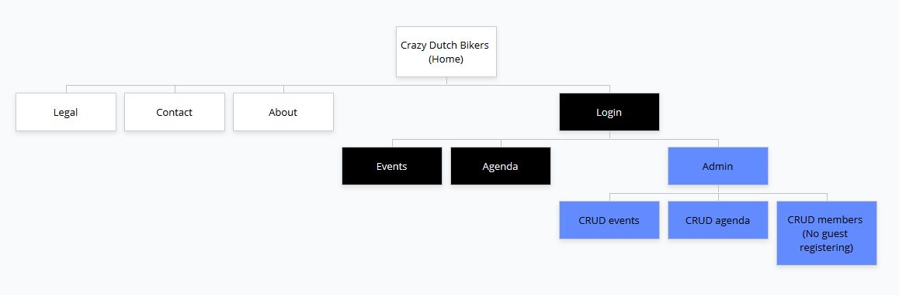

# Initial ideas

## General Sitemap for idea of site structure

[Edit](https://www.gloomaps.com/Y7tdJMNAme)

## Database design

### users

* id
* role (lid, beheer)
* name
* email
* password (hash)
* etc.

### events

* id
* published_by
* published_at
* updated_at
* title
* body (WYSIWYG)
* date (for agenda)

## Roles

### admin

Responsible for new members, events, calendar etc.

### member

Be able to access the events and calendar etc.

### guest

Only have access to the about, home etc.

## Hosting

Digitalocean via [Laradock guide](https://laradock.io/guides/#Digital-Ocean) lijkt simpel genoeg en in een paar uurtjes klaar